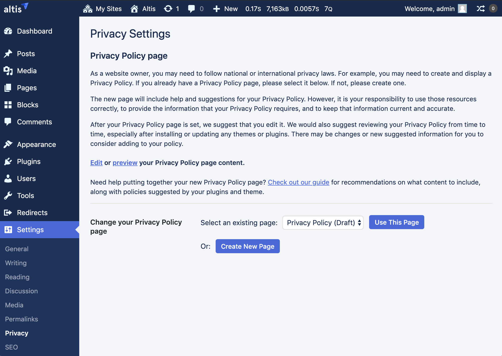

# Privacy API

The CMS provides extensible privacy tools including a default privacy policy page and hooks for additional code to suggest content for it, as well as the ability to register user data export and deletion callbacks.

## Privacy Policy Page

The privacy policy page is automatically generated as a draft with basic information related to the operation of the CMS along with headings for sections that should be filled out with more detailed information such as what analytics and trackers are running on the site.

[The default page is available to edit here](internal://admin/post.php?post=3&action=edit).

Before launching a site it is important to fill out this page and publish it.

The standard content hierarchy is as follows:

- Who we are
- What personal data we collect and why we collect it
  - Comments
  - Media
  - Contact forms
  - Cookies
  - Embedded content from other websites
  - Analytics
- Who we share your data with
- How long we retain your data
- What rights you have over your data
- Where we send your data
- Your contact information
- Additional information
  - How we protect your data
  - What data breach procedures we have in place
  - What third parties we receive data from
  - What automated decision making and/or profiling we do with user data
  - Industry regulatory disclosure requirements

### Using an Existing or Alternative Page

Under the Settings > Privacy admin menu item it is possible to select which page you would like to use as the privacy policy page.



## Suggesting Privacy Policy Content

**`wp_add_privacy_policy_content( string $identifier, string $policy_text )`**

This function will provide an editor working on the privacy policy page with prompts for content they can add and the code or feature it relates to. The text should aim to answer one of the default headings described above.

If you need to provide information that fits under multiple sections you can make multiple calls to this function to make it easier for editors to pull out the relevant content where needed.

It is recommended to link out to any 3rd party privacy policies where relevant.

```php
// Must be called on the `admin_init` hook.
add_action( 'admin_init', function () {
	$policy_text = sprintf(
		__( 'The Google Analytics feature collects information
			about your browser and how you interact with the website.
			If you are logged in this information may be associated with
			your account. You can learn more by visiting the
			<a href="%s">Google Privacy Policy</a> page.'
		),
		'https://policies.google.com/privacy?hl=en'
	);
	wp_add_privacy_policy_content( 'google-analytics', $policy_text );
} );
```

## Personal Data Exports

When a user makes a request for an export of their personal data a confirmation request should be sent to them via the [ Export Personal Data tool](internal://admin/tools.php?page=export_personal_data) by filling in their email address and clicking send.

Once they have confirmed their request a zip file is created and emailed to them.

### Extending User Data Export

By default the export will contain any data known to be associated with the requester's email address such as comments or posts. Some code may extend the platform in such a way that it cannot determine all the data associated with the user automatically.

To extend the data export use the following function:
